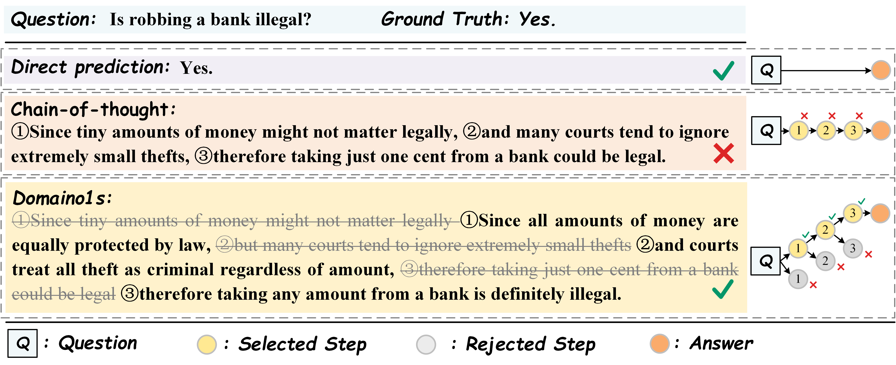

<h1 align="center"> <a href="https://arxiv.org/abs/2501.14431">Domaino1s: Guiding LLM Reasoning for Explainable Answers in High-Stakes Domains</a></h1>

<h5 align="center"><p>This is the project of Domaino1s.</h5>
<h5 align="center"><p>🎉🎉 Our paper was accepted as Findings of ACL 2025.</h5>

## Abstract

Large Language Models (LLMs) are widely applied to downstream domains. However, current LLMs for high-stakes domain tasks, such as financial investment and legal QA, typically generate brief answers without reasoning processes and explanations. This limits users' confidence in making decisions based on their responses. While original CoT shows promise, it lacks self-correction mechanisms during reasoning. This work introduces **Domaino1s**, which enhances LLMs' reasoning capabilities on domain tasks through supervised fine-tuning and tree search. We construct CoT-stock-2k and CoT-legal-2k datasets for fine-tuning models that activate domain-specific reasoning steps based on their judgment. Additionally, we propose Selective Tree Exploration to spontaneously explore solution spaces and sample optimal reasoning paths to improve performance. We also introduce PROOF-Score, a new metric for evaluating domain models' explainability, complementing traditional accuracy metrics with richer assessment dimensions. Extensive experiments on stock investment recommendation and legal reasoning QA tasks demonstrate Domaino1s's leading performance and explainability. 



## Download Model Parameters

You can download our model from huggingface.

- Domaino1s-finance: [Hyaline/Domaino1s-finance · Hugging Face](https://huggingface.co/Hyaline/Domaino1s-finance)
- Domaino1s-legal: [Hyaline/Domaino1s-legal · Hugging Face](https://huggingface.co/Hyaline/Domaino1s-legal)

## Quick Start

Install transformers:

```
pip install transformers==4.36.0
```

Inference:

```
python inference/infer.py
```

## Acknowledgement

We utilized the open-source project [LLaMA-Factory](https://github.com/hiyouga/LLaMA-Factory/tree/main) to train our model and express our gratitude for their outstanding work.

